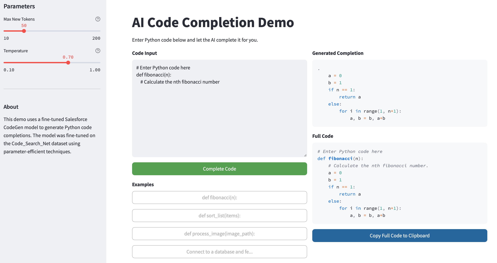

# AI-powered Code Autocompletion

This project demonstrates the implementation of an AI-powered code autocompletion model using the Salesforce CodeGen model with parameter-efficient fine-tuning techniques.

## Project Overview

Code autocompletion tools have revolutionized software development by predicting and suggesting code as developers type. The growing insurgence of GitHub Copilot and Cursor Tab, a code autocomplete project was simply a must-try for me. This project aims to fine-tune a pre-trained Large Language Model (LLM) to complete Python code snippets based on function signatures, docstrings and the function itself. The model is trained on Python functions from the `Code_Search_Net` dataset.

## Features

- Uses the [`Salesforce/codegen-350M-mono`](https://huggingface.co/Salesforce/codegen-350M-mono) model as a base model (from `huggingface`)
- Implements Parameter-Efficient Fine-Tuning (PEFT) with Low-Rank Adaptation (LoRA) to reduce trainable parameters
- Training and evaluation pipeline for code completion
- Demo App

### Demo App



## Technical Implementation

The project includes:

1. Data preparation from the `Code_Search_Net` dataset
2. Tokenization optimized for code
3. Parameter-Efficient Fine-Tuning with LoRA
4. Training and evaluation pipeline
5. Example generation and testing

## Getting Started

### Prerequisites

- Python 3.8+
- PyTorch
- Transformers
- Datasets
- PEFT library

All project libraries and package requirements are listed in the `requirements.txt` file. To install the requirements, check below "Install dependencies".

### Running the Project

1. Clone the repository:

   ```bash
   git clone https://github.com/yourusername/ai-code-autocompletion.git
   cd ai-code-autocompletion
   ```

2. Install dependencies:

   ```bash
   pip install -r requirements.txt
   ```

   or in conda environments (recommended):

   ```bash
   conda install -r requirements.txt
   ```

3. Open and run the Jupyter notebook:

   ```bash
   jupyter notebook notebooks/ai_code_autocompletion.ipynb
   ```

4. Follow the steps in the notebook to train and evaluate the model.

5. To train the model locally:

   ```bash
   # Set environment variables
   export MODEL_PATH="models/newly-trained model" # The trained model will be saved to this path
   export WANDB_API_KEY="your-wandb-api-key"  # Optional for metrics tracking

   # Run the training script
   python src/training/train.py \
       --model_name="Salesforce/codegen-350M-mono" \
       --output_dir=$MODEL_PATH \
       --num_epochs=3 \
       --batch_size=8 \
       --learning_rate=5e-4
   ```

6. Also it is possible to train the model on [Google Colab](https://colab.research.google.com) by simply uploading the `notebooks/Model_training.ipynb` notebook to `Google Colab` and hitting Run.

## Usage Example

After training, you can use the model to complete code snippets:

```python
# Example code completion
function_prefix = "def process_image(image_path):\n    # Load and preprocess image\n    import numpy as np\n    img = "
completion = generate_completion(model, tokenizer, function_prefix)
print(f"Completion: {completion}")
```

## Demo Application

A web-based demo application is available to showcase the code completion model's capabilities:

- Simple web interface built with `Gradio`
- Syntax highlighting for Python code
- Adjustable parameters (temperature, max tokens)

### Running the Demo

```bash
# Make sure to install the required libraries (included in the requirements.txt)
pip install gradio pygments

# Run the demo app (from the root directory)
python src/app/demo.py
```

Then open your browser at [http://localhost:7860](http://localhost:7860) to interact with the demo.

## Metrics Tracking

The `Codegen-350M-mono` model makes use of [Weights & Biases](https://wandb.ai) for metrics tracking. (You will need an account to get an API key).

### Training Metrics


### Evaluation Metrics


### GPU Performance Metrics


## Challenges and Limitations

1. Context Window Limitations: The model can only see a limited amount of context (often just the current function), making it difficult to understand the broader codebase.
2. Computational Efficiency: Code suggestions must appear nearly instantaneously to be useful, requiring more (GPU) power and model optimization for low latency.

## Conclusion

This project demonstrates the feasibility of fine-tuning a code autocompletion model using modern techniques such as PEFT and LoRA. The Salesforce CodeGen model shows promising results for not only Python code completion tasks and can easily be extended and trained with other programming languages.

## Remarks

The notebook in `notebooks/` was my original submission for my end semester project for the Deep Learning and AI course I took (Winter 2025). I decided to expand the idea into this fully-flegded project you see now using industry best practices for model development and test. This is the first of its kind for me. If you're reading this, it really means a lot to me.
